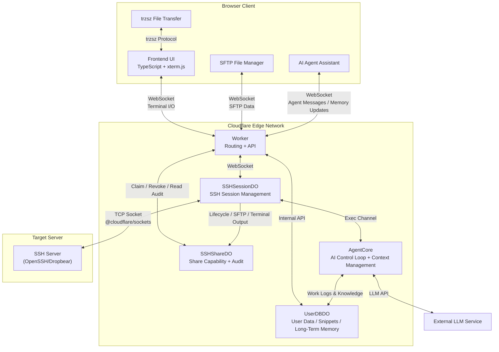

<div align="center">
  
  <p>A Serverless Web SSH Terminal built on Cloudflare Workers: Connect and manage your servers directly from the browser.</p>
  <p><b>Ultra-lightweight · Out-of-the-box · Cyberpunk UI</b></p>
  <p>
    <a href="https://github.com/newbietan/CloudSSH/stargazers"></a>
    <a href="LICENSE"></a>
    
    
    
  </p>
  <p>
    <a href="#highlights">Highlights</a> ·
    <a href="#features">Features</a> ·
    <a href="#quick-start">Deployment</a> ·
    <a href="#architecture">Architecture</a> ·
    <a href="CHANGELOG.md">Changelog</a> ·
    <a href="#contributors">Contributors</a> ·
    <a href="#license">License</a>
  </p>
  <p>
    <a href="README.md">简体中文</a> |
    <a href="README_en.md">English</a>
  </p>
</div>

> [!TIP]
> **CloudSSH** utilizes Cloudflare Workers' TCP Sockets support to handle SSH protocol parsing and forwarding at edge nodes, providing a low-latency Web Terminal experience.

## Demo

> Imagine opening your browser anytime, anywhere, and connecting to your server with a highly futuristic cyberpunk UI, without installing any SSH client.

<div align="center">
  <a href="https://www.bilibili.com/video/BV1UgMt6UEdF" target="_blank" title="Click to play video">
    
    <br/>
    
  </a>
  <p><sub>Video duration 19:48 · Full CloudSSH walkthrough</sub></p>
</div>

## Table of Contents

<details>
<summary><b>Click to expand Table of Contents</b></summary>

- [Highlights](#highlights)
- [Features](#features)
- [Architecture](#architecture)
- [Quick Deployment](#quick-start)
  - [GitHub Integration](#recommended-deploy-via-github-integration)
    - [Automatically Sync Upstream](#optional-automatically-sync-upstream-releases)
  - [Configurable Environment Variables](#configurable-environment-variables)
  - [Configure Turnstile](#optional-configure-turnstile-human-verification)
  - [Configure GitHub OAuth](#optional-configure-github-oauth-login--server-management)
- [Development](#development)
  - [Local Development](#local-development)
- [Contributors](#contributors)
- [License](#license)

</details>

<a id="highlights"></a>

## Highlights

### Ultimate Serverless

- **Zero Server Cost**: Pure frontend + Cloudflare Workers, no backend servers to maintain.
- **Edge Acceleration**: Cloudflare's global edge network routes connections to the nearest location for low-latency SSH.

### Out of the Box

- **One-Click Deployment**: Fork the repo and connect GitHub in the Cloudflare Dashboard to build and deploy automatically, no local environment needed.
- **Modern Tech Stack**: TypeScript + Vite + Tailwind CSS + xterm.js, balancing performance and maintainability.

### Secure and Reliable

- **Two-Segment Encryption**: HTTPS/WSS between browser and Worker; the Worker-to-server segment uses the full SSH-2.0 protocol (Curve25519-SHA256/ECDH-NISTP256 key exchange, AES-256-GCM/CTR encryption, HMAC-SHA2 integrity).
- **Host-Key Verification**: Ed25519/ECDSA P-256/P-384/P-521/RSA signature checks with a SHA-256 fingerprint on first connection (TOFU).
- **Defense in Depth**: IPv6/reserved-address SSRF blocking plus DNS-rebinding protection, bounded in-memory rate limiting, Turnstile verification, and AES-256-GCM encryption for saved credentials in per-user SQLite storage.
- **Session Isolation**: Each terminal session runs in an independent Durable Object; an active outbound SSH TCP connection keeps it awake.
- **Internal Credential Flow**: On one-click connect, the server decrypts credentials and hands them to the session via a one-time token; the browser never sees the plaintext.

<a id="features"></a>

## Features

<details>
<summary><b>Click to expand full feature list (Custom SSH Stack, Jump Chains, One-Time Sharing, SFTP, AI Agent, etc.)</b></summary>

- **Pure TypeScript SSH-2.0 Implementation**: Fully self-developed SSH protocol stack, with no dependency on any third-party SSH libraries, implementing all cryptographic operations based on Web Crypto API.
- **Multi-Algorithm Key Exchange**: Supports Curve25519-SHA256 (preferred) and ECDH-NISTP256 KEX algorithms, compatible with various SSH servers (including Dropbear).
- **Reliable Key Transitions and Packet Framing**: Re-evaluates encryption and authentication state for every packet, including servers that return `SSH_MSG_NEWKEYS` and the first encrypted packet in the same TCP chunk.
- **IPv4/IPv6 Dual Stack**: Full support for both IPv4 and IPv6 address connections, including automatic handling of IPv6 bracket notation.
- **Multiple Auth Methods**: Supports standard SSH password authentication, multi-round RFC 4256 `keyboard-interactive` authentication, and OpenSSH-format Ed25519, ECDSA P-256/P-384/P-521, and RSA private keys. Interactive authentication supports passwords, OTPs, multiple prompts, and a second factor after public-key authentication. Server prompts appear in a connection-bound safety dialog, and a saved password is substituted only after an explicit user action. RSA uses RSA-SHA2-256/512 by default; legacy `ssh-rsa` SHA-1 is allowed only through explicit compatibility configuration.
- **SSH Jump Hosts / Bastions**: Signed-in users may select another saved server as a jump host. CloudSSH builds each layer with the standard RFC 4254 `direct-tcpip` channel and does not require `ssh`, `nc`, or `socat` on the remote host. Up to 3 jump hosts are supported; the final target's terminal, SFTP, and AI Agent use the complete encrypted chain. Authentication and path-scoped host-key verification run independently at every hop.
- **One-Time SSH Access Sharing**: Optionally lets signed-in users share saved servers. The link contains only a 256-bit random capability, never the host, username, password, private key, or jump route. Only its hash is stored; it can be claimed once and has separate claim and session lifetimes. Shared sessions allow the terminal and SFTP while the backend disables AI Agent, OS detection, host-key mutation, and reconnect. Owners can revoke live access and review share-only lifecycle, SFTP, and terminal-output records.
- **MitM Protection (TOFU)**: Automatically extracts and prints the server's Host Key (SHA-256 fingerprint) on the first connection, supporting Ed25519/ECDSA/RSA signature verification, and caches known host keys locally and via API to prevent MitM on future connections.
- **Geek Terminal Experience**: Powered by `@xterm/xterm` and the `@xterm/addon-webgl` hardware acceleration rendering engine, ensuring silky smooth scrolling even with massive log outputs.
- **Reliable Terminal Clipboard Interaction**: Completing a terminal selection with a mouse automatically copies it, and right-click pastes directly. On touch devices, tapping Copy in the shortcut bar enters selection mode; drag across terminal text and tap Copy again to finish, avoiding unreliable long-press selection, while Paste remains a separate action. Paste data follows xterm.js's native input pipeline, emits bracketed-paste control sequences only when the remote application enables that mode, and normalizes line endings for compatibility with Vim and regular shells.
- **Mobile Terminal Support**: Phones and tablets get dynamic visual-viewport sizing, soft-keyboard and safe-area handling, iOS Chinese IME compatibility, a compact action bar, one-shot Ctrl/Alt, Esc/Tab/arrows/Home/End/PgUp/PgDn shortcuts, and full-screen Agent/SFTP panels. After a page returns from the background, CloudSSH actively validates the WebSocket and replaces connections that only appear open. Anonymous sessions rebuild SSH from the current in-memory credentials, while signed-in saved servers request a fresh one-time connection token; the UI and terminal input return to the connected state only after `shell_ready`. Users may explicitly request fullscreen landscape; unsupported orientation locks fall back to a manual rotation hint without changing desktop layouts. If the mobile OS completely discards the page, the current shell cannot be resumed seamlessly.
- **Customizable UI**: Theme V4 offers built-in Standard Dark, Standard Light, Cyberpunk, and macOS 26-inspired Liquid Glass themes. V4 adds gradient/mesh background layers (with a readability scrim and a slow drift animation), a scanline/flicker/glow/noise effect registry, an independent surface-blur and saturation tier (`saturate(180%)` + specular inner highlights), and typography scaling, so themes differ far beyond color swaps. The companion [GitHub Pages theme editor](https://newbietan.github.io/CloudSSH/) provides live controls for colors, shape, density, font, shadows, motion, background layers, effects, and button/input/card/tab styles, with previews for login, server list, terminal + SFTP, and the AI Agent panel. Themes are imported, exported, backed up, and shared as JSON files. Signed-in users sync imported themes to their account for cross-browser restoration, while anonymous users keep them in the current browser only.
- **SFTP Graphical File Manager**: Integrated with a complete SFTP v3 file transfer protocol, providing a graphical file browser interface. The toolbar features hierarchical path breadcrumbs navigation (click to jump directly to parent directories, click empty space to toggle absolute path text input), and file lists support bidirectional sorting by name, size, and modified time (directories stay pinned to the top). Supports one-click creation of new blank files with automatic CodeMirror editor opening. Supports directory browsing, file upload/download, creating new folders, file renaming, and deletion, plus plain selection, `Cmd/Ctrl` toggle selection, `Shift` range selection, select all, batch file downloads, and batch deletion. Double-clicking files is handled intelligently (text files open directly in the online editor, binary or oversized files automatically route to the serial download queue). Built-in CodeMirror online editor edits remote text files in place (≤2MB; UTF-8 editable, GBK/GB18030 detected as read-only), preserving the original line endings and BOM, with automatic remote-change detection and an explicit overwrite confirmation before saving, as well as line-wrapping preference toggling in the footer. Common configs (shell/YAML/JSON/Python/Markdown/HTML/CSS/Dockerfile/systemd, etc.) get syntax highlighting. Built on the SSH subsystem, it runs alongside terminal sessions without interference and supports download queues and upload cancellation.
- **Native File Transfer**: Integrated with [trzsz.js](https://github.com/trzsz/trzsz.js), supporting `trz` (upload) / `tsz` (download) commands for file transfer, fully compatible with tmux sessions. Also supports drag-and-drop file upload to the terminal, directory transfer, and resumable transfers. (Requires [trzsz](https://trzsz.github.io/) installed on the remote server)
- **Bilingual UI**: Ships built-in Simplified Chinese and English translations, automatically following the browser language with a manual override; the choice is persisted via a URL parameter or local storage (`cloudssh_locale`).
- **GitHub OAuth Integration**: Supports GitHub login, allowing users to save and manage frequently used SSH servers for one-click connections; supports one-click server configuration cloning (Duplicate Server) with sanitized credentials. Each server can have up to 10 normalized tags; the list supports instant search by name, host, or username, tag filtering, and responsive pagination (9 cards per page on desktop, 6 on tablets, 3 on mobile).
- **Slide-Over Command Snippet Drawer & Category Management**: Completely redesigned into a slide-over drawer panel matching the SFTP layout, keeping the active terminal fully visible side-by-side. Features horizontal **Category Chips** for deduplicated count aggregation and filtering, `<datalist>` category autocompletion on the collapsible entry form, and real-time fuzzy search. Supports `{{var}}` dynamic parameter placeholders with parameter entry dialogs, one-click plain text copying, and filling into or executing directly on the active terminal. Snippets are stored with per-`user_id` row isolation in `UserDBDO` (name ≤50, command ≤2000, category ≤30, ≤100 per user); anonymous users fall back to local `localStorage`. Reachable from desktop and mobile toolbars, and hidden in one-time share sessions.
- **Automatic Server OS Detection**: When a signed-in user first connects to a saved server without an OS record, CloudSSH uses a separate SSH exec channel after the terminal is ready to read `/etc/os-release` or `uname`, then shows the corresponding system icon on the server card. Detection runs in the background without blocking the terminal. Only recognized results are saved; unknown results are retried naturally on the next connection, and changing the host or port clears stale results. Anonymous connections do not run this check. The read-only command may appear in the target server's SSH audit logs.
- **Private IP Display and Quick Copy**: Valid IPv4 and IPv6 addresses are visually masked in the saved-server list and connection status bar to reduce accidental disclosure in demos or screenshots. The complete connection address remains available through mouse or keyboard copy. Hostnames remain unchanged; visual masking is not encryption or access control.
- **Single-Page Multi-Tab Session**: Switch between multiple independent SSH terminal and SFTP instances within a single browser tab, with isolated sandbox environments. Tabs support double-click inline renaming (Enter to save, Esc or empty input to cancel and restore original name, synchronized immediately to the header), plus a right-click context menu (rename tab, duplicate session to new tab, close other tabs, close tab). While on the server list or anonymous connection page, a toolbar/form button returns you to an established SSH session in one click, and pressing `Esc` does the same when the terminal is hidden; the button appears and hides along with the tab count.
- **Secure Connection History**: Saves last 5 connection records locally. Credentials (passwords/private keys) can be client-side encrypted using locally derived AES-256-GCM keys.
- **Dual-Segment Latency & Colo Display**: Instantly and periodically monitor WebSocket RTT (client to CF), physical latency (CF to SSH host), and the current Cloudflare datacenter code (e.g. `CF-LAX`) on the status bar, with green, yellow, and red indicators for network quality.
- **Smart Region Scheduling (locationHint)**: Queries IPinfo when a direct server is saved, persists the inferred Durable Object region, and reuses it on connection without another runtime geo lookup. With SSH jumps, only the outermost entry reached directly by Cloudflare is inferred; downstream private servers do not trigger a lookup and inherit placement from that entry. Failures fall back to Cloudflare's default placement, and users may manually override direct-entry regions. _Note: automatic inference sends the direct entry's host information to the third-party IPinfo service. locationHint is a Cloudflare best-effort feature and may fall back to a nearby region when capacity is unavailable._
- **In-Terminal Text Search & Shortcuts**: Real-time log search support via `Ctrl+Shift+F` (or `Cmd+F` on macOS); clear terminal screen and scrollback buffer via `Cmd+K` (macOS) / `Ctrl+Shift+K` (Win/Linux) without conflicting with shell-native `Ctrl+K`.
- **Terminal Log Export**: Download the entire screen buffer of the active terminal session as a `.txt` file with a single click on the header download button, avoiding browser freezes when selecting long logs.
- **AI Agent Assistant & Server Memory System**: Built-in AI Agent sidebar with BYOK (Bring Your Own Key) support for OpenAI-compatible APIs (e.g., DeepSeek, GPT-4o, Qwen, Claude). The configuration modal features a modern custom Combobox dropdown (full listing, instant fuzzy search, one-click clearing, and multi-theme adaptivity) with secure, token-free model retrieval using stored credentials, fortified by strict Base URL binding against credential exfiltration, same-origin CSRF defense, and sensitive token sanitization. Features Quick Prompt Chips (Analyze Error, System Load, Network Ports, Docker Status) for instant diagnostic prompt insertion with auto-focus. Provides 8 specialized operations tools (execute commands, read terminal context, detect environment, list processes, systemctl management, Docker management, user confirmation, and structured report output). Supports attaching terminal selections as untrusted context snapshots, one-click code block copying, safe single-line command filling, LLM streaming output, and collapsible thinking process containers with multi-level safety controls.
  - **Dual-Track Long-Term Memory**: Features accurate time anchoring and user-local timezone conversion (Today, Yesterday, N days ago). Divided into **Work Logs** (rolling activity history that automatically fuses consecutive troubleshooting tasks via `update_latest` to prevent fragmented spam) and **Context Knowledge & Credentials** (automatically distills tokens, passwords, ports, and path configs so future tasks reuse them directly without repeated questioning; backed by key normalization and atomic upserts).
  - **Decoupled Short/Long-Term Memory**: In-session summaries exclusively track active task goals and unresolved decisions, while persistent server memory archives ops history and configuration entities, eliminating redundant prompt bloat.
  - **Unobtrusive Drawer UI**: Integrated into a dedicated "Work Logs & Knowledge" drawer panel. Work log cards feature two-line truncation, full-text hover tooltips, and click-to-expand; sensitive credentials are masked by default with one-click visibility toggling, quick copying, and deletion.
- **Quality Gates**: Before deploying either `test` or `main`, GitHub Actions performs frozen-lockfile installation, Worker/frontend type checking, unit and integration tests, reproducible frontend builds, Playwright browser E2E, and axe accessibility regression. Any failure blocks deployment.

</details>

<a id="architecture"></a>

## Architecture

### System Architecture



<a id="quick-start"></a>

## Quick Deployment

### Prerequisites

- A Cloudflare account.
- Cloudflare Workers Free Plan enabled (required for TCP Sockets and Durable Objects features).

### Steps

#### Recommended: Deploy via GitHub Integration

<div align="center">
  <a href="https://dash.cloudflare.com/?url=https://github.com/newbietan/CloudSSH">
    
  </a>
  <p>Click the button to jump to the Cloudflare console, authorize your GitHub account, and deploy automatically</p>
</div>

1. **Fork this repository** to your GitHub account.
2. **Create Worker App**: Log in to Cloudflare, go to Workers & Pages, click Create Application, connect your GitHub account, and select the forked repository.
3. **Build Command**: During deployment settings, enter `pnpm run build:frontend` as the Build command, then save and deploy.
4. **Access the App**: After successful deployment, access via the default domain `https://cloudssh.<your-subdomain>.workers.dev`.
5. **Bind Custom Domain** (Optional): Go to Worker Settings → Domains & Routes → Add, enter your domain and confirm.

> **Note**: To deploy a test environment, repeat the above steps on the `test` branch to create a separate Worker (e.g., `cloudssh-test`). The Durable Objects data between both environments is completely isolated.

##### Optional: Automatically Sync Upstream Releases

A fork can use the built-in `Sync upstream` GitHub Actions workflow to periodically synchronize the latest `main` branch from this project into its own `main` branch. This feature is **disabled by default**. Once enabled, it checks daily at 04:20 Asia/Shanghai; branch updates created by a successful sync are automatically built and deployed by Cloudflare Git integration, so no additional deployment toggle is required.

1. Make sure the Cloudflare Worker is connected to your fork, its Production branch is set to `main`, and automatic builds are enabled.
2. Open the fork's **Actions** page and enable workflows. If an existing fork does not yet contain `Sync upstream`, first use GitHub's **Sync fork** feature once to obtain the workflow.
3. Go to **Settings → Secrets and variables → Actions → Variables** and create a Repository variable:
   - Name: `AUTO_SYNC_UPSTREAM`
   - Value: `true`
4. To sync immediately, open **Actions → Sync upstream → Run workflow**. Manual runs do not require the variable above.

> **Sync behavior**: If upstream workflows change, automatic synchronization may fail. In that case, simply synchronize the repository manually once.

#### Configurable Environment Variables

All feature flags and security controls are managed through Worker environment variables configured in the Cloudflare Dashboard under **Settings → Variables and Secrets** (sensitive credentials should use the encrypted **Secret** type) and applied immediately upon the next deployment:

| Environment Variable | Required | Default | Description | Recommendations & Notes |
| --- | --- | --- | --- | --- |
| `IDLE_TIMEOUT` | Optional | `30m` | User inactivity idle timeout duration. Automatically closes the session and releases the Durable Object when no keyboard input, SFTP transfer, or AI task occurs. | **Strongly recommended to keep default or configure**. Prevents abandoned tabs from burning through Cloudflare's daily 13,000 GB-s free DO quota. Supports `30m`, `1h`, `1800s`, `1800` (raw numbers parsed as seconds); set to `0` to disable; an in-terminal warning appears 60s before timeout, and pressing any key immediately resets the timer. |
| `GITHUB_CLIENT_ID` | Required if login enabled | None | GitHub OAuth Application Client ID; enables multi-user login and cloud-synchronized server / snippet management. | Public identifier. Must be used together with `GITHUB_CLIENT_SECRET` and `BASE_URL`. When omitted, the login entry point is automatically hidden without affecting anonymous SSH. |
| `GITHUB_CLIENT_SECRET` | Required if login enabled | None | GitHub OAuth Application Client Secret used by the server to safely exchange user authorization codes for access tokens. | **Sensitive credential; strongly recommended to set as Secret type in Cloudflare Dashboard**. Never expose or commit to public repositories. |
| `BASE_URL` | Required if login enabled | None | Full public origin URL of the deployed application (e.g. `https://ssh.example.com`), used to construct OAuth authorization redirect callbacks. | Must exactly match the Authorization callback URL domain configured in your GitHub OAuth App, without trailing slashes `/`. Falls back to the request Host header if omitted. |
| `GITHUB_ALLOWED_USER_IDS` | Optional | None (unrestricted) | Comma-separated allowlist of GitHub **numeric user IDs** permitted to sign in (e.g. `83105156,6236783`). | **Core security control for private instances**. When unset, any GitHub user can log in; once set, non-allowlisted users are rejected (fails closed). Obtain your numeric ID by visiting `https://api.github.com/users/<username>` and checking the `id` field. |
| `REQUIRE_GITHUB_AUTH` | Optional | `false` | Whether to require GitHub authentication for all terminal connections. When set to `true`, anonymous direct SSH access is completely disabled. | **Recommended for public deployments**. Prevents unauthorized visitors from using your Worker as an open outbound SSH jump proxy. |
| `TURNSTILE_SITEKEY` | Optional | None | Cloudflare Turnstile human-verification public Site Key. | Public key. Used together with `TURNSTILE_SECRET`. Turnstile verification is automatically disabled if either variable is omitted or empty. |
| `TURNSTILE_SECRET` | Optional | None | Cloudflare Turnstile human-verification Secret Key used for server-side verification token validation. | **Sensitive credential; recommend storing as Secret type**. Effectively blocks automated crawlers, botnets, and credential stuffing. |
| `ENABLE_SSH_SHARING` | Optional | `false` | Whether to enable audited one-time SSH sharing. When `true`, signed-in owners can generate temporary audited access links for saved servers. | Enable as needed. Shared sessions are strictly constrained (restricted terminal, optional SFTP, no AI Agent, no server metadata mutation) and fully audited. |
| `STRICT_HOST_KEY_VERIFY` | Optional | `true` | SSH host-key signature verification mode. Defaults to `true` (fails closed if signature verification fails or key algorithm is unsupported). | **Strongly recommended to keep default `true` in production**. Only set to `false` in development/testing environments when connecting to non-standard legacy servers. |
| `DEBUG_MODE` | Optional | `false` | Detailed protocol debugging switch. When `true`, outputs detailed handshake and protocol logs in API responses and the frontend terminal. | Declared as `false` in `wrangler.toml`. Only enable temporarily when troubleshooting connection handshakes; keep `false` during regular production operation. |

> **Configuration Recommendations & Notes**:
> 1. **Encrypted Secret Storage**: In the Cloudflare Dashboard under *Settings → Variables and Secrets*, it is strongly recommended to store all sensitive variables containing passwords, Secrets, or Keys as **Secret** type. Secrets are stored in Cloudflare's dedicated encrypted storage layer and will not be overwritten when rebuilding or redeploying code.
> 2. **Reserved Variables**: `MAX_CONNECTIONS` is declared as an interface placeholder for future connection budgeting; it is currently unread by runtime code, so do not rely on it.

> **Note**: For local CLI deployment or debugging the Worker, see the Local Development section under Development below.

#### Optional: Configure Turnstile Human Verification

To prevent malicious bot abuse, it is recommended to enable Cloudflare Turnstile verification:

1. **Create Turnstile Widget**: Log in to [Cloudflare Dashboard](https://dash.cloudflare.com/), go to the Turnstile page and create a new Widget.
2. **Get Keys**: After creation, you will receive a **Site Key** (public) and a **Secret Key** (private).
3. **Configure Environment Variables**: In the Cloudflare Dashboard Workers settings, go to "Settings" → "Variables and Secrets", add the following environment variables:
   - `TURNSTILE_SECRET` = your Secret Key
   - `TURNSTILE_SITEKEY` = your Site Key
4. **Redeploy**: Run the deployment command to apply the configuration.

#### Optional: Configure GitHub OAuth Login & Server Management

With GitHub OAuth enabled, users can log in with their GitHub account and save/manage their frequently used SSH servers in a personal dashboard for one-click connections. When not configured, this feature is automatically hidden and does not affect the anonymous SSH connection functionality.

1. **Create a GitHub OAuth App**:
   - Go to GitHub → Settings → Developer settings → OAuth Apps → [New OAuth App](https://github.com/settings/applications/new)
   - **Application name**: `CloudSSH` (customizable)
   - **Homepage URL**: `https://your-domain.com` (your deployed domain)
   - **Authorization callback URL**: `https://your-domain.com/api/auth/callback`
   - After creation, note the **Client ID**, then click **Generate a new client secret** to get the **Client Secret** (shown only once, save it immediately)

2. **Configure Environment Variables**: In the Cloudflare Dashboard Workers settings, go to "Settings" → "Variables and Secrets", add the following environment variables:
   - `GITHUB_CLIENT_ID` = your Client ID
   - `BASE_URL` = `https://your-domain.com` (your deployed domain)
   - `GITHUB_CLIENT_SECRET` = your Client Secret

   The following two independent settings are optional:

   - `GITHUB_ALLOWED_USER_IDS`: Comma-separated GitHub **numeric user IDs** allowed to sign in, for example `83105156,6236783`. When omitted, every GitHub account may sign in. An empty or malformed configured value fails closed and denies every GitHub sign-in.
   - `REQUIRE_GITHUB_AUTH`: Set to `true` to disable anonymous SSH and require a valid GitHub session for every SSH WebSocket. When omitted or set to `false`, anonymous connections remain available.
   - `ENABLE_SSH_SHARING`: Set to `true` to let signed-in users create one-time links for saved servers. It is disabled by default. Enabling it explicitly permits a bearer of the share capability to open an audited SSH session without signing in to GitHub.

   **Find a GitHub numeric user ID**:

   - Open `https://api.github.com/users/octocat` in a browser (replace `octocat` with the actual username) and read the `id` field in the returned JSON. For example, `"id": 583231` means the numeric user ID is `583231`.
   - Or run:

     ```bash
     curl -s https://api.github.com/users/octocat | jq '.id'
     ```

   Use `id`, not the username or `node_id`. The numeric ID does not change when the username changes; separate multiple IDs with commas.

| Configuration                   | GitHub sign-in         | Anonymous SSH                    |
| ---------------                 | ----------------       | ---------------                  |
| Neither setting                 | All GitHub users       | Allowed                          |
| `GITHUB_ALLOWED_USER_IDS` only  | Allowlisted users only | Allowed                          |
| `REQUIRE_GITHUB_AUTH=true` only | All GitHub users       | Disabled                         |
| Both settings                   | Allowlisted users only | Disabled (private-instance mode) |

1. **Redeploy**: Save the variables and redeploy the existing Worker. The Durable Object migration in the repository initializes the required classes and database; deleting the existing Worker is not required.

> **Access Policy Note**: After `GITHUB_ALLOWED_USER_IDS` changes, existing sessions are checked again and become invalid on their next request; already established SSH WebSockets are not terminated. `REQUIRE_GITHUB_AUTH=true` depends on GitHub OAuth, so configure the Client ID, Client Secret, and `BASE_URL` together.

##### Using One-Time SSH Sharing

1. Configure GitHub OAuth, set `ENABLE_SSH_SHARING=true` on the Worker, and redeploy.
2. Connect normally to the target and every jump host first so all route-scoped host fingerprints are trusted.
3. Select Share on the server card, then choose a claim window (5/15/30/60 minutes) and maximum session duration (15/30/60/120 minutes).
4. Copy the generated link immediately and send it through a trusted channel. CloudSSH does not retain the plaintext capability, so the same link cannot be displayed again.
5. The recipient opens the link and accepts terminal-output and SFTP recording before claiming it. A link can be claimed once; refresh, disconnect, or tab closure cannot reconnect it.
6. The owner can reopen Share management to inspect status and audit records or revoke a pending/live share. Revoking a live share closes both terminal and SFTP.

> [!WARNING]
> Although the capability contains no SSH metadata, possession grants a full Shell and SFTP session using the owner's saved credential, so protect it like a temporary password. Sharing requires trusted fingerprints for the complete route and stops on fingerprint changes or `keyboard-interactive`/MFA challenges. Audit stores server PTY output rather than raw keyboard input: it usually shows shell-echoed commands but cannot prove every command executed with echo disabled, inside scripts, or through encoded input. Do not treat it as host-level enhanced auditing. A session is closed if its 5 MiB recording limit is reached or audit writes fail.

##### Using SSH Jump Hosts

Jump hosts require no additional environment variables, but GitHub OAuth and saved servers must be enabled:

1. Save the outermost public jump host A, which Cloudflare can reach directly.
2. Save target B and select A in the **Jump host** field. B may use a private address that is reachable only from A.
3. For a multi-hop path such as C → A → B, configure C as A's jump host, then configure A as B's jump host. CloudSSH resolves the relation recursively and permits at most 3 jump hosts.
4. Connect to B from the server list. Terminal, SFTP, and AI Agent channels open only on final target B; a failure at any hop closes or rebuilds the complete chain.

Every server in a jump relation must belong to the same GitHub user. Self-references and cycles are rejected, and a jump host cannot be deleted while another server references it. Public-address SSRF checks and Durable Object region placement use the outermost address reached directly by Cloudflare. Only that entry runs automatic region inference; selecting a jump host disables the downstream server's region option and does not send its private host information to IPinfo. Private targets are accepted only inside a server-resolved saved chain, and anonymous clients cannot submit jump configuration. TOFU host-key verification runs at every hop, with private target records scoped by the complete jump path.

<a id="development"></a>

## Development

### Project Structure

This project uses pnpm monorepo workspace structure:

```
CloudSSH/
├── src/                    # Backend source (Cloudflare Worker)
│   ├── ssh/                # SSH protocol pure implementation layer
│   └── worker/             # Worker entry and Durable Objects
│       ├── agent/          # AI Agent control loop, tools, safety
│       ├── dns-check.ts    # DNS-rebinding SSRF defense
│       ├── ip-geo.ts       # IPinfo region inference → locationHint
│       ├── share-audit-writer.ts # Share session audit event writer & debouncing
│       ├── ssh-interactive-auth.ts # RFC 4256 interactive keyboard auth state machine
│       └── ssh-detached-buffer.ts   # Detached session 128KB buffer queue
├── frontend/               # Frontend source (independent workspace)
│   └── src/                # TypeScript + xterm.js + trzsz
│       ├── agent/          # AI assistant sidebar UI
│       ├── i18n/           # Chinese/English strings and locale resolution
│       ├── sftp-editor-session.ts # SFTP online editing coordinator
│       ├── sftp-helpers.ts        # SFTP breadcrumb parsing and multi-key sorting
│       └── snippet-variables.ts   # Command snippet parameter placeholders parsing & replacement
├── docs/                   # GitHub Pages static assets
│   └── theme-editor/       # Visual theme editor
├── scripts/                # Build scripts
├── tests/                  # Vitest unit/integration + Playwright E2E and axe regression (build/ e2e/ ssh/ worker/)
├── .github/workflows/      # CI/CD workflows (deploy / github-pages / sync-upstream)
├── biome.json              # Code formatting and lint conventions
├── playwright.config.ts    # Browser E2E test configuration
├── pnpm-workspace.yaml     # pnpm workspace configuration
└── wrangler.toml           # Cloudflare deployment configuration
```

### Local Development

<details>
<summary><b>Click to expand Local Development Guide (prerequisites, dev server, commands, git workflow)</b></summary>

#### Environment Setup

1. **Fork and Clone the Repository**

   ```bash
   git clone https://github.com/<your-username>/CloudSSH.git
   cd CloudSSH
   ```

2. **Install Dependencies** (root and frontend separately)

   ```bash
   pnpm install
   cd frontend && pnpm install
   ```

3. **Login to Cloudflare** (required on first run, credentials are cached afterward)

   ```bash
   npx wrangler login
   ```

   > **Note**: When using Wrangler Dev for local development, it connects to your Cloudflare account to access Durable Objects and TCP Sockets. Real SSH TCP traffic is forwarded through Cloudflare's infrastructure.

4. **Configure GitHub Actions** (Optional, for automatic deployment)

   If you want to deploy to your own Cloudflare account via GitHub Actions, modify the repository owner in `.github/workflows/deploy.yml`:

   ```yaml
   if: github.repository_owner == 'your-github-username'
   ```

   Also configure the following Secrets in your repository Settings → Secrets and variables → Actions:
   - `CLOUDFLARE_API_TOKEN`: Your Cloudflare API Token
   - `CLOUDFLARE_ACCOUNT_ID`: Your Cloudflare Account ID

#### Start Development Server

```bash
pnpm run dev
```

This command builds the frontend and starts the Wrangler local development environment, supporting:

- Automatic rebuild on frontend code changes
- Automatic reload on Worker code changes
- Full Durable Objects and TCP Sockets functionality

After the dev server starts, visit the local address shown in the terminal (usually `http://localhost:8787`) to start debugging.

#### Common Development Commands

| Command                   | Description                                               |
| ---------                 | -------------                                             |
| `pnpm run dev`            | Build frontend + start Wrangler dev server                |
| `pnpm run build:frontend` | Build frontend only (output to `frontend/dist/`)          |
| `pnpm run typecheck`      | Type-check Worker and frontend TypeScript                 |
| `pnpm test`               | Run Vitest unit and integration tests                     |
| `pnpm run test:e2e`       | Run Playwright browser E2E and axe accessibility tests    |
| `pnpm run verify`         | Run type checks, tests, production build, and browser E2E |
| `pnpm run deploy:test`    | Build and deploy the isolated test environment            |

#### Submitting Changes

**Do NOT create feature branches.** All changes must be committed directly to the `test` branch to keep the repository clean.

```
test branch (dev/test)  ──merge──>  main branch (production)
```

1. Switch to the `test` branch: `git checkout test`
2. Pull the latest code: `git pull origin test`
3. Develop and test locally
4. Commit and push directly: `git push origin test`
5. After testing passes, the maintainer will merge `test` into `main`

> **Note**: The `main` branch has protection rules that prevent direct pushes. All changes must be committed to the `test` branch first. Do NOT create `feat/xxx`, `fix/xxx` or any other feature branches — commit directly to `test`.

</details>

<a id="contributors"></a>

## Contributors

Thank you to the following contributors for improving CloudSSH's code, compatibility, and user experience:

| Contributor                                          | Key Contributions                                                                                                                                                           |
| -------------                                        | -------------------                                                                                                                                                         |
| [TanXin (@newbietan)](https://github.com/newbietan)  | Project creator and maintainer; Cloudflare Serverless architecture, SSH/SFTP, AI Agent, security, theming, and engineering infrastructure                                   |
| [David xu (@xqdoo00o)](https://github.com/xqdoo00o)  | Dropbear compatibility, migration to trzsz file transfer, PTY sizing, and session exit/reconnection improvements                                                            |
| [vonl1 (@vonl1)](https://github.com/vonl1)           | Terminal selection auto-copy, Vim-compatible right-click paste, masked IPv4/IPv6 display with quick full-address copy, and automatic server OS detection with branded icons |
| [Leon Xu (@xuthuslei)](https://github.com/xuthuslei) | Fixed encryption-state transitions and packet parsing when `SSH_MSG_NEWKEYS` and the first encrypted packet arrive in the same TCP chunk; fixed the v1.11.0 jump-host authentication-timing regression (#108) |

The list and contribution summaries are based on Git history and accepted Pull Requests; one contributor may appear under multiple historical Git author names or email addresses. See [GitHub Contributors](https://github.com/newbietan/CloudSSH/graphs/contributors) for the complete record. Issues and Pull Requests are welcome.

<a id="license"></a>

## License

This project is open-sourced under the [Apache License 2.0](LICENSE).

**Original Author and Attribution Requirement**: CloudSSH was initiated and architected by [TanXin (@newbietan)](https://github.com/newbietan), who continues to maintain the project. Any modified, derivative, or redistributed version based on this project must retain the license, copyright, and attribution notices in [LICENSE](LICENSE) and [NOTICE](NOTICE), and clearly state and credit the original author and original project link.

Commercial use, modification, and redistribution remain governed by the [Apache License 2.0](LICENSE). The attribution requirement above preserves the source and authorship of the original project without restricting other rights granted by the license.

Issues and Pull Requests are welcome to help build the community. If you find this project helpful, please consider giving it a ⭐ Star. Thank you very much for your support!

## Star History

<a href="https://www.star-history.com/?repos=newbietan%2FCloudSSH&type=date&legend=top-left">
 <picture>
   <source media="(prefers-color-scheme: dark)" srcset="https://api.star-history.com/chart?repos=newbietan/CloudSSH&type=date&theme=dark&legend=top-left&sealed_token=W6EXioqdcb2BEJNCLBVZIvRGDUYCaxki-xY1FfDVex2S8hS-ABAc84mDRxLIx0wQLFCd3Wh_p-t4bD4yT_iPkhi0_7Aciixag0Vj0_Qsqv3Wh_pbiD6Ykw" />
   <source media="(prefers-color-scheme: light)" srcset="https://api.star-history.com/chart?repos=newbietan/CloudSSH&type=date&legend=top-left&sealed_token=W6EXioqdcb2BEJNCLBVZIvRGDUYCaxki-xY1FfDVex2S8hS-ABAc84mDRxLIx0wQLFCd3Wh_p-t4bD4yT_iPkhi0_7Aciixag0Vj0_Qsqv3Wh_pbiD6Ykw" />
   
 </picture>
</a>
